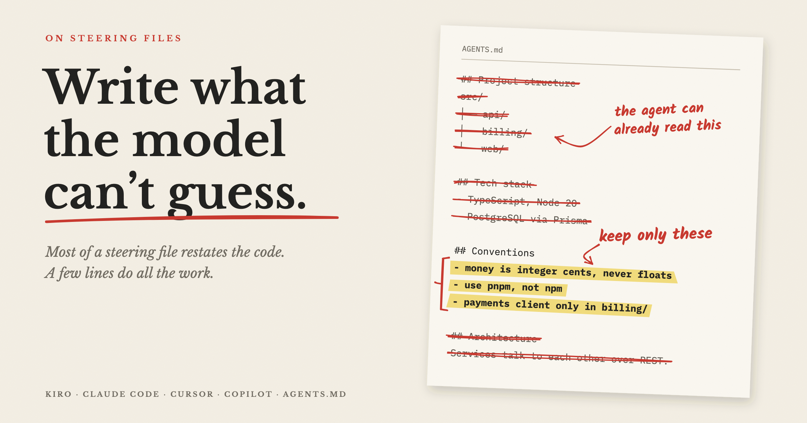
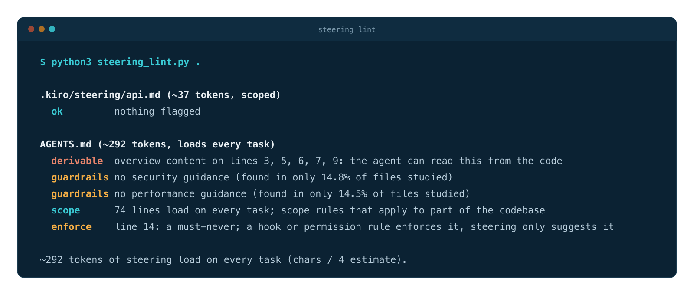
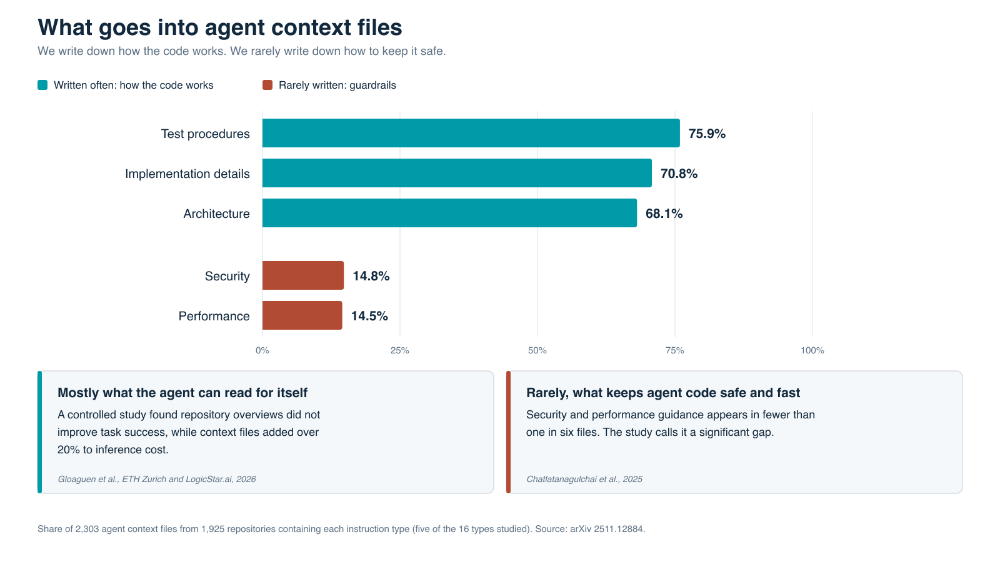
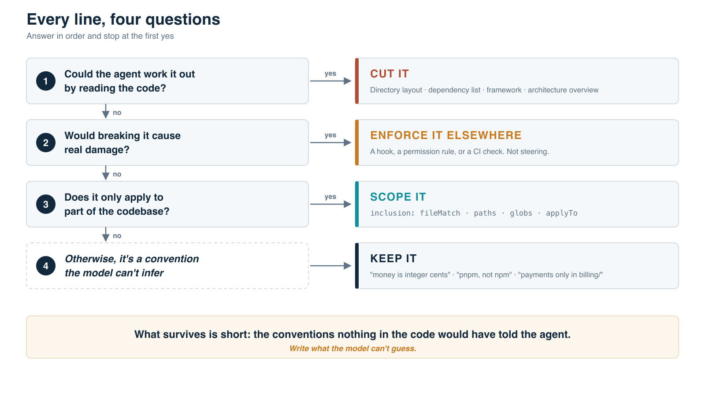
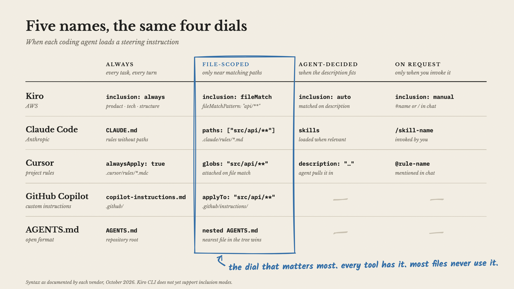
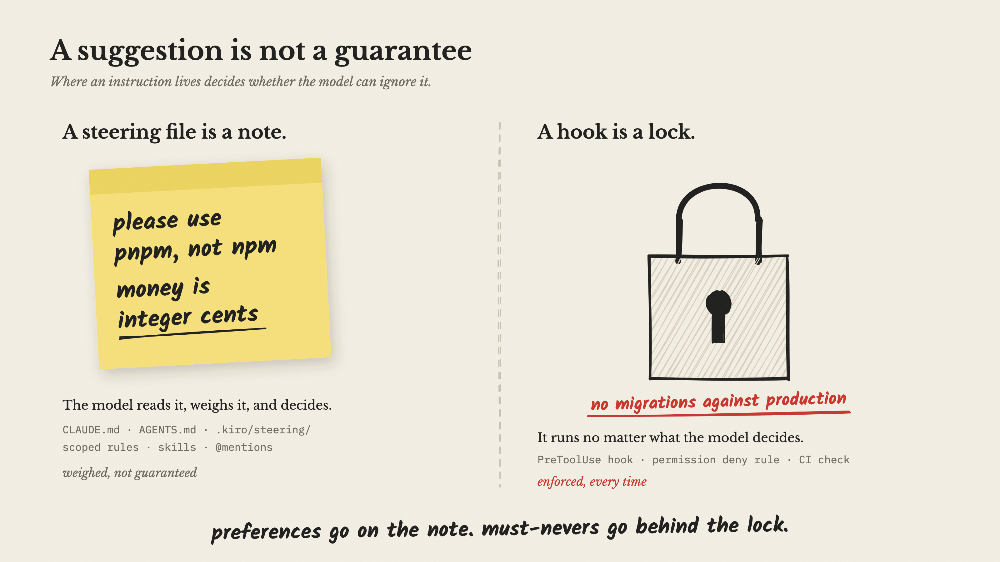

<p align="center">
  
</p>

<h1 align="center">Write what the model can't guess</h1>

<p align="center">
  A linter for the steering files every coding agent reads, and the research behind it.<br>
  Companion code for the article <a href="article/write-what-the-model-cant-guess.md"><b>Write What the Model Can't Guess</b></a>.
</p>

<p align="center">
  <a href="https://github.com/sirik11/steering-files/actions/workflows/test.yml"></a>
  
  
  <a href="LICENSE"></a>
</p>

---

Every coding agent now reads a steering file before it touches your code: Kiro's `.kiro/steering/`, Claude Code's `CLAUDE.md`, Cursor's `.cursor/rules/`, Copilot's `.github/copilot-instructions.md`, and the cross-tool `AGENTS.md`.

> Providing context files "does not generally improve task success rates, while increasing inference cost by over 20% on average."
> — [Gloaguen et al., ETH Zurich and LogicStar.ai, 2026](https://arxiv.org/abs/2602.11988)

The part that works is narrow: **conventions the model can't infer from the code.** `steering_lint.py` finds everything else.

## Quick start

One file, standard library only. Drop it anywhere and point it at a repository.

```bash
curl -O https://raw.githubusercontent.com/sirik11/steering-files/main/steering_lint.py
python3 steering_lint.py path/to/your/repo
```

<p align="center">
  
</p>

Output on a small demo repository: a scoped Kiro file passes clean, and a typical `AGENTS.md` doesn't. It exits non-zero only when it finds something that looks like a credential, so it can gate CI.

## What it checks

| Check | Flags | Why it matters |
| --- | --- | --- |
| `derivable` | Directory trees and overview sections: structure, tech stack, architecture | The agent can read these from the code. Repository overviews [didn't improve task success](https://arxiv.org/abs/2602.11988) |
| `guardrails` | No security or performance guidance at all | Each appears in [under 15% of 2,303 files](https://arxiv.org/abs/2511.12884) studied |
| `scope` | A long file that loads on every task | Kiro `fileMatch`, Claude `paths`, Cursor `globs`, and Copilot `applyTo` exist for this |
| `enforce` | "Never" rules about production, secrets, migrations, or deploys | Steering is [context, not enforced configuration](https://code.claude.com/docs/en/memory); a hook holds regardless |
| `secret` | Strings that look like credentials | Fails the run |
| `size` | Over 200 lines (500 for Cursor `.mdc`) | Vendor guidance; every line costs context on every task |

It finds `AGENTS.md`, `CLAUDE.md`, `CLAUDE.local.md`, `GEMINI.md`, `.claude/rules/`, `.cursor/rules/`, `.cursorrules`, `.kiro/steering/`, `.github/copilot-instructions.md`, and `.github/instructions/`, and ends with an estimate of the tokens of steering that load on every task.

These are heuristics, tested against real steering files from public repositories, with regression cases in [`test_steering_lint.py`](test_steering_lint.py). The real test is the one the ETH authors recommend: run a common task with and without your steering file, and compare the outcome and the cost.

## The research in one chart

<p align="center">
  
</p>

We write down how the code works. We rarely write down how to keep it safe and fast.

## The idea in four questions

<p align="center">
  
</p>

## This repository follows its own advice

Its own [`AGENTS.md`](AGENTS.md) is seven lines of conventions an agent couldn't infer by reading the code, and CI lints it on every push. The security rule doesn't say "never commit credentials"; it points to the CI check that actually enforces that.

## Figures

| | |
| :---: | :---: |
| <br>**Five names, the same four dials** | <br>**A suggestion is not a guarantee** |

Every figure is generated by [`figures/make_figures.py`](figures/make_figures.py). SVG to edit, PNG to publish:

```bash
cd figures && python3 make_figures.py
rsvg-convert -w 1600 -h 900 fig1-same-four-dials.svg -o fig1-same-four-dials.png   # and so on
```

The diagrams are original. Reuse them with attribution.

## Sources

- [Evaluating AGENTS.md: Are Repository-Level Context Files Helpful for Coding Agents?](https://arxiv.org/abs/2602.11988), Gloaguen et al., 2026
- [Agent READMEs: An Empirical Study of Context Files for Agentic Coding](https://arxiv.org/abs/2511.12884), Chatlatanagulchai et al., 2025
- [Instruction Adherence in Coding Agent Configuration Files](https://arxiv.org/abs/2605.10039), McMillan, 2026
- Vendor docs: [Kiro](https://kiro.dev/docs/steering/) · [Claude Code](https://code.claude.com/docs/en/memory) · [Cursor](https://cursor.com/docs/context/rules) · [GitHub Copilot](https://docs.github.com/en/copilot/how-tos/configure-custom-instructions/add-repository-instructions) · [AGENTS.md](https://agents.md/)

## License

[MIT](LICENSE) © 2026 Sai Shirish Katady
